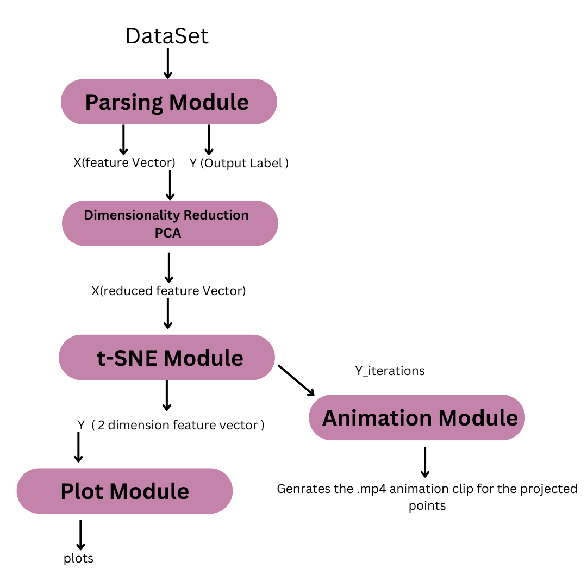

# t-Distributed Stochastic Neighbour Embedding ( t-SNE )

    

## Introduction

Data visualization provides an accessible way to see and understand trends, patterns in data, and outliers. Data visualization tools and technologies are essential to analyzing massive amounts of information and making data-driven decisions. Here we present the t-SNE algorithm for reducing the dimensions of the point and thus analysing the data.

## Implementation Pipeline

Our implemented tSNE algorithm could be split into multiple modules, which are as follows : 

### Parsing Module

- Reading and parsing the dataset, and separating the data into the features, and labels, and returning the feature vector **`X`** and the label vector **`y`**
- This could be found in the `parser` folder, which returns the desired dataset feature vectors and their corresponding labels.

### Dimensionality Reduction : PCA

- Principal component analysis (PCA)'s main goal is to minimize the number of connected variables in a data set while preserving as much of the data set's inherent variance as possible. A new set of variables called principal components (PCs), which are uncorrelated and are sorted so that the first few keep the majority of the variance included in all of the original variables, is used to achieve this.
- The reference paper [tsne](https://www.jmlr.org/papers/volume9/vandermaaten08a/vandermaaten08a.pdf) suggests reducing the dimensions of the data to 30 or so components, using the standard linear dimensionality reduction method **PCA**.
- This module takes input as the feature vector **X ( with features > 30 )** and returns the feature vector X, with reduced features ( = 30 )
- We apply the main `t-sne` algorithm on this vector with the reduced dimensions.

    

## Core t-SNE
### Animation and Plotting: Displaying the Results

- This module takes in the reduced dimension points `Y` and generates figures and plots for the same in the lower dimensional space, providing useful insights and visualizations of the data set points, with similar or related points clustered together and placed nearby in the low dimensional feature space.
- We implemented the animation of the `tsne` algorithm, wherein we present the variations the points undergo as they projected in the lower dimensional space as the gradient descent step is followed.
- This shows the step by step change in the projections, and clustering of similar points in the lower dimensional space.
- We attach the link for the video animations for the three data sets in the following drive link : [https://drive.google.com/drive/folders/1GvQ83nCLwFHNSRVotEXsDc6SastkVC8f?usp=sharing](https://drive.google.com/drive/folders/1GvQ83nCLwFHNSRVotEXsDc6SastkVC8f?usp=sharing)
- The code for this could be found in the `[makeAnimation.py](http://makeAnimation.py)` module. , which employs matplotlib functions to animate and create the simulation.

## Data Sets Used 

We used the following datasets for running and analysing our t-SNE algorithm.

1. **`MNIST`** :
    1. The MNIST data set6 contains 60,000 grayscale images of handwritten digits. For our experiments, we randomly selected 6,000 of the images for computational reasons. The digit images have 28 × 28 = 784 pixels (i.e., dimensions). 
    2. The data set used has 60k handwritten images of digits 0-9 ( black and white) which could be found at [https://www.kaggle.com/competitions/digit-recognizer/data?select=train.csv](https://www.kaggle.com/competitions/digit-recognizer/data?select=train.csv)

2. **`Coil-20`** :
    1. The processed dataset, contains images for all of the objects in which the background has been discarded (and the images consist of the smallest square that contains the object)
    2. The data set could be found at [https://www.kaggle.com/datasets/3defe8fe86a5eedce3906f162cc11b20dad9a7591fe713fd14308575cae47cdd](https://www.kaggle.com/datasets/3defe8fe86a5eedce3906f162cc11b20dad9a7591fe713fd14308575cae47cdd)

3. **`Netflix`** :
    1. T*his tabular dataset consists of listings of all the movies and tv shows available on Netflix, along with details such as - cast, directors, ratings, release year, duration, etc.*
    2. The dataset could be found at [https://www.kaggle.com/datasets/shivamb/netflix-shows](https://www.kaggle.com/datasets/shivamb/netflix-shows)

4. **`Olivetti`** : 
    1.   The Olivetti faces data set 7 consists of images of 40 individuals with small variations in viewpoint, large variations in expression, and occasional addition of glasses. The data set consists of 400 images (10 per individual) of size 92 × 112 = 10, 304 pixels, and is labeled according to identity. We used `sklearn` datasets for the Olivetti dataset.

## Results and Plots 

## References 

1. Visualizing data using t-SNE  <a href="https://www.jmlr.org/papers/volume9/vandermaaten08a/vandermaaten08a.pdf">[PDF]</a>

    Maaten, L.v.d. and Hinton, G., 2008. Journal of Machine Learning Research, Vol 9(Nov), pp. 2579—2605.

## Contributing Members 

- Gaurav Singh
- Shubh Karman Singh Bhullar
- Venika Sruthi 
- Karmanjyot Singh