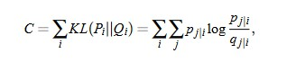

## t-SNE 
---

#### An Introduction 

1. A better alternate to the existing visualisation techniques like PCA, etc. for visualising higher dimensional data into 2-D plots.
2. Here we generate a mapping from the higher dimensional data set X = ${x_1,x_2,x_3 ..... x_n}$ to Y = ${y_1,y_2,y_3.......y_n}$ .. while retaining maximum possible structure of the higher dimensional data.

#### SNE ( Stochastic Neighbor Embedding ) 

Glossary - **embedding** : refers to the vector representation of a particular feature.

1. It consverts high-dimensional data points between the points into conditional probabilities that represent the similarities. 
2. The similarity is expressed through the conditional probability $p_i$ $_|$ $_j$ such that the data point $x_i$ would pick the data point $x_j$ as it's neighbour if the neighbours were picked in proportion to their probability density under a Gaussian centered at $x_i$.
3. Thereby we aim to reduce the difference between the similarities of the points in the higher dimensional space ( the x's ) and the lower dimensional space ( the y's ). **Gradient Descent** is utiised wherein we try to minimise the cost function Kullback-Leibler equation over all of the data points. 

#### Kullback-Leiber Equation

1. The cost function isnt symmetric, thereby not all the weights are weighted equally, and thus there is a large distance amongst the points in 2-D projection for the points from higher dimension that have low similarity. Thereby, retaining **local structure** of the data in the mapping.

2.  Entropy increases with increasing $\sigma_i$, thereby a smaller $\sigma_i$ is preffered in dense regions than in sparse regions.
3. **SNE** : 
    - It is obstructed by the **crowding problem**, the optimisation equation doesn't reaches a global minimum, thereby need to vary that gaussian noice and variance at the start.
    - **t-SNE vs SNE** : 
        1. t-SNE uses a symmetric SNE version rather than the unsymmetric version of it.
        2. Uses a student-t distribution rather than the gaussian distribution for defining the probability function for our similarity computations.
        3. t-SNE involves: 
            - Plotting a gaussian graph centered at the point we looking at, 
            - Draw a horizontal line, connecting the given point to the point we calculating similarity with.
            - t-standard distribution is evenly spread and not much high in the middle while a bit higher than the normal distribution at the tails.
            - **Perplexity** : We define an average estimate of the closeness or the measure of how clustered the data points are, on an average. 

4. **The Crowding Problem** 
    - Since SNE used a normal distribution, which is characterized by a greater height in the middle and lower height of the graph at it's tail or as it spreads.
    - Due to the normal distribution, having a high value in the center as compared to the tails, the farther points get lower similarity value and nearby points get higher similarity values.
    - Thereby, in SNE due to the normal distribution the less scattered or the less densed data samples have a little spreaded normal distribution and thereby could have higher similarities and thus have a tendency to cluster nearby.  
